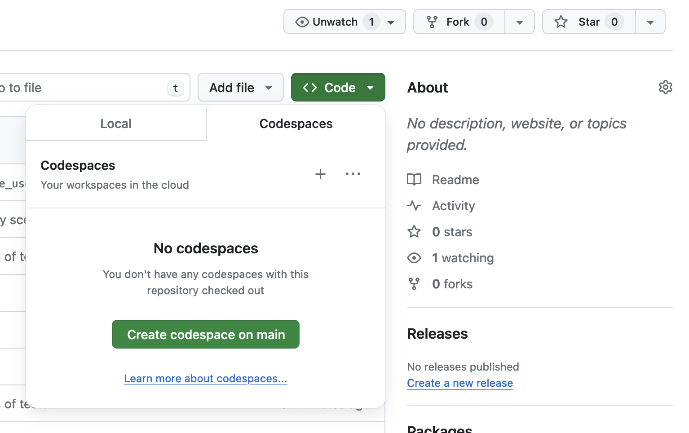

To initialize the data environment, open a github codespace:



Once started, execute the following commands in the terminal:

```
$ dbt seed
$ dbt build
```

to verify the data product:

```
$ dbt test
```

to inspect the underlying data yourself:

```
$ duckcli database.duckdb
> select * from active_users
```

what we get:

```
+-----------------+----------------+
| name            | num_activities |
+-----------------+----------------+
| Uwe Probst      | 14             |
| Guo Hsiung      | 8              |
| Harriet Ledesma | 8              |
| Teresa Dodson   | 14             |
+-----------------+----------------+
```
